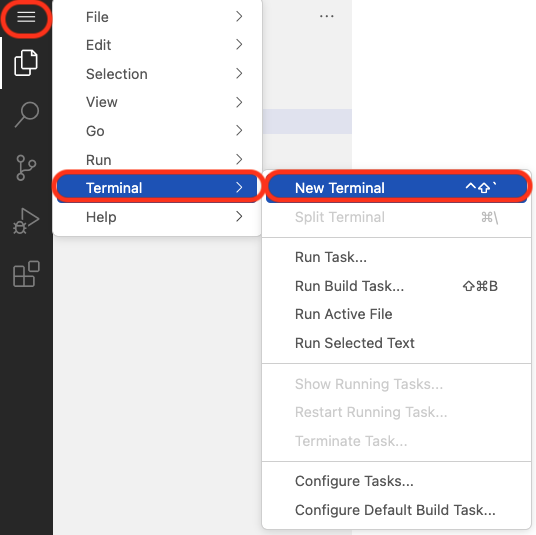
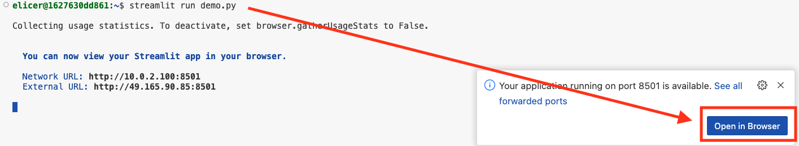
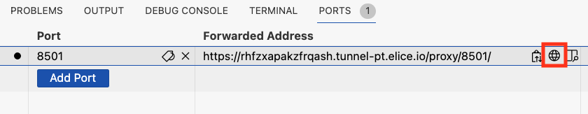
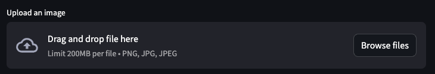

## 이미지 변환

해당 프로그램은 아래 예시와 같이 최신화된 템플릿(Black Slides)에 맞춰 이미지 색상을 변환하는 프로그램입니다. 

아래 순서로 이미지를 업로드 후 변환된 이미지를 다운로드 받으실 수 있습니다.

1. 터미널을 엽니다. 


2. 아래 명령어를 입력합니다.
```sh
streamlit run img.py
```

3. 명령어 입력 후 나오는 우측 하단 창 "Open in Broswer" 누르시거나, 이 창이 꺼졌으면 "PORTS" 에서 지구본 모양을 눌러 브라우저에서 확인합니다.

**[ "Open in Broswer" ]**

**[ "PORTS" ]**


4. Upload and image 영역에 변환할 이미지를 드래그 앤 드롭 or `Browse files` 버튼을 눌러 업로드합니다.




5. 이미지 변환 결과를 확인하고, `Download Inverted Image` 버튼을 눌러 다운로드합니다.

**[ 이미지 변환 예시 ]**
